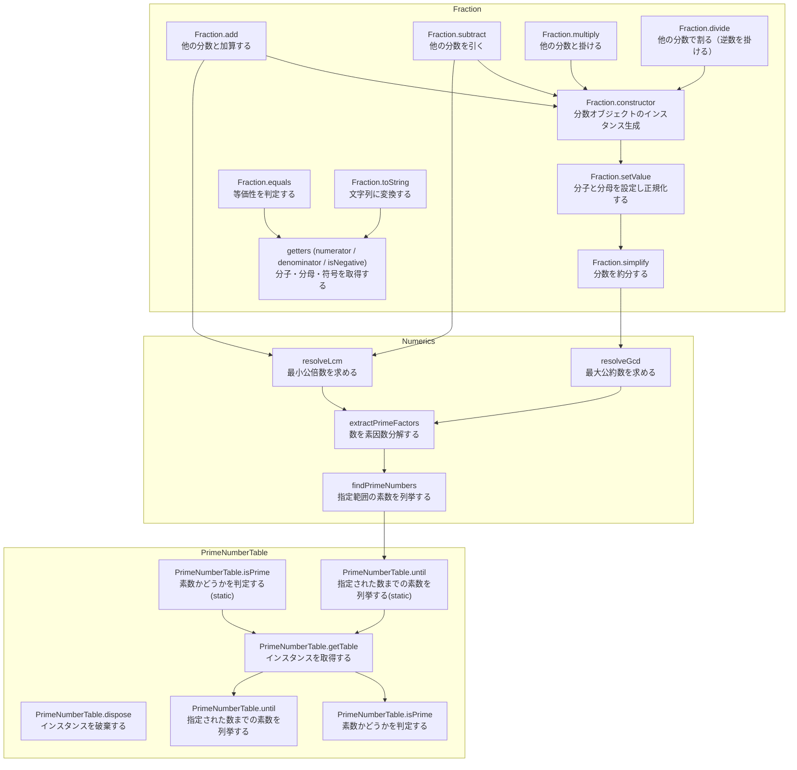

# 分数を表すクラスライブラリ

## 概要

### このプロジェクトの目的

このプロジェクトは、TypeScriptの基本的な文法や仕組み（例えばJavaScriptへトランスパイルして動かす流れ）を学びつつ、コードの整形や静的解析、テストフレームワークといった開発ツールの使い方を実際に体験するために作成しました。

### このプロジェクトの機能概要

#### `fraction.ts` は分数を表すクラスを宣言する(メイン機能)

このプロジェクトは、分数（たとえば 3/4 や -1/2）の扱いを簡単にするための小さなライブラリです。想定される使い方を以下に示します。

```ts
// １つ目の分数
const fraction1 = new Fraction(1, 3);
// ２つ目の分数
const fraction2 = new Fraction(1, 2);

// 足し算をする
const result = fraction1.add(fraction2);

console.log(`分子: ${result.numerator}`); // 分子: 5
console.log(`分母: ${result.denominator}`); // 分母: 6
```

このように、`Fraction` クラス( `fraction.ts` )は分子・分母・符号を管理し、分数の足し算・引き算・掛け算・割り算や、分数を簡単にする（約分する）機能があります。

#### `numerics.ts` は正の整数を取り扱うためのライブラリ(補助機能)

分数の四則演算は想像以上に大変で、通分や約分ができるようになる必要があって、そのためには、最大公約数や最大公倍数を計算できるようになる必要があります。
このれらの機能を実現するために、`numerics.ts`があります。 には、約分で使う最大公約数を求める関数や、素数を見つける・数を素因数に分けるといった補助的な処理が含まれいます。

`numerics.ts`の主な使い方を以下に示します。

```ts
// 10までの素数を列挙します
const primes = findPrimeNumbers(10);
console.log(primes); // [1, 2, 3, 5, 7]

// 28を素因数分解します
const fragments = extractPrimeFactors(28);
console.log(fragments);
// [
//    { base: 2, exponent: 2 },
//    { base: 7, exponent: 1 }
// ]

// 最大公約数を求める
const gcd = resolveGcd(28, 6);
console.log(gcd); // 2

// 最小公倍数を求める
const lcm = resolveGcd(28, 6);
console.log(lcm); // 84
```

#### 最もディープな素数判定ライブラリ `prime-number-table.ts`

素数に関する機能を集約したのが、`pri`
与えられた数が素数であるかどうか、

## ファイル一覧

| ファイル名                   | 概要                           |
| ---------------------------- | ------------------------------ |
| [numerics.ts](./numerics.md) | 正の整数を取り扱うライブラリ   |
| [fraction.ts](./fraction.md) | 分数を表すライブラリ           |
| prime-number-table.ts        | 素数判定テーブル管理ライブラリ |

## コールグラフ


