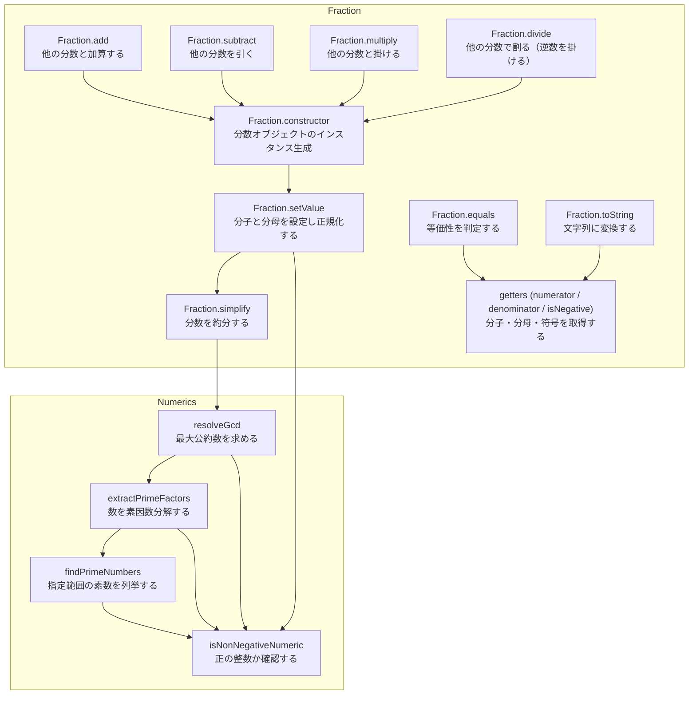

# 分数を表すクラスライブラリ

## 概要

### このプロジェクトの目的

このプロジェクトは、TypeScriptの基本的な文法や仕組み（例えばJavaScriptへトランスパイルして動かす流れ）を学びつつ、コードの整形や静的解析、テストフレームワークといった開発ツールの使い方を実際に体験するために作成しました。

### このプロジェクトの機能概要

このプロジェクトは、分数（たとえば 3/4 や -1/2）の扱いを簡単にするための小さなライブラリです。
Fraction クラスは分子・分母・符号を管理し、分数の足し算・引き算・掛け算・割り算や、分数を簡単にする（約分する）機能を手軽に使えるようにしています。
numerics.ts には、約分で使う最大公約数を求める関数や、素数を見つける・数を素因数に分けるといった補助的な処理が含まれており、学習やちょっとした計算の実装に役立ちます。

## ファイル一覧

| ファイル名                   | 概要                         |
| ---------------------------- | ---------------------------- |
| [numerics.ts](./numerics.md) | 正の整数を取り扱うライブラリ |
| [fraction.ts](./fraction.md) | 分数を表すライブラリ         |

## コールグラフ

