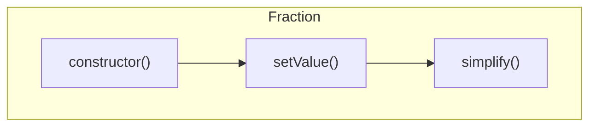

# 共通課題

## [CMN001]: 単体テストの理解

`__tests__/unit-test/prime-number-table.test.ts`(テストコード) と、`src/prime-number-table.ts`(ソースコード)を開いてみよう。
ソースコードの各関数について、ヘッダコメントの条件を満たしていることを確認しているのが、テストコードです。

例えば、25行目から始まる

```ts
    test('10 までの素数を列挙', () => {
        const test = 10;
        const expected = [1, 2, 3, 5, 7];
        const actual = PrimeNumberTable.until(test);
        expect(actual).toEqual(expected);
    });
```

を見てみましょう。

これは、`PrimeNumberTable.until()` というスタティックメソッドをテストしています。
引数に `10` を与えると、10までの素数 `[1, 2, 3, 5, 7]` が返却されることを確認しています。
`expect(actual).toEqual(expected)`の部分で、`actual` (`PrimeNumberTable.until()`の戻り値)が`expected`(期待している値)と一致していることを確認しています。

これがテストコードと、実装コードの関係です。

次に56行目から始まるブロックに注目してください。

```ts
    test('0はエラーになることを確認', () => {
        const test = 0;
        expect(() => {
            PrimeNumberTable.until(test);
        }).toThrow();
    });
```

これは、`PrimeNumberTable.until()` が`0`を与えると例外が発生することを確認しています。


## [CMN002]: `Fraction.simplify()` の単体テストを書こう

### テストコードと仕様の理解

次は、`src/fraction.ts` に関するテストと実装です。
テストコードは、`__tests__/unit-test/fraction.test.ts`にあります。
`simplify()` は分数の約分を実装します。
しかしながら、`simplify()` は `private`なメソッドなので、直接はテストできません。

以下のような呼び出し関係であることを前提に、`constructor()`のテストとしてテストします。



### テストコードの記述

実装する前に `simplify()`や`constructor` はこういう機能であるということを確認しておきましょう。

* 分子(`numerator`)と分母 `denominator` の最大公約数を求めて、それらで割り算をする。
* 分子や分母が負の符号がついていても、分子/分母にはその絶対値だけが格納されて、`isNegative`の値でその分数の符号を表す。
* 分母に`0`を入れると例外が発生する

これらのテストを記述してみましょう。
50行目のブロックを参考にテストケースを書きましょう。
上記の3つのケースには、様々なバリエーションがあるはずです。
現在は `2/4` しかテストしていませんが、約分しないケースはどうでしょうか？
考えられるケースをいろいろ考えて記述してください。

### モッキングってなんだ？

`Fraction.ts` から見ると、`numerics.ts`は外のライブラリです。
`numerics.ts` が完成していないとき、このテストができないというのは大変効率が悪いです。
その悩みを解決するのが**モッキング**です。

`resolveGcd()`, `resolveLcm()` はこの時点では実装されていないかもしれません。
そこで、これらを偽物(テスト用)の関数に置き換えるのが**モッキング**です。
35行目の
```ts
jest.mock('../../src/numerics', () => {
    // モッキングしない関数はそのまま
    const originalModule = jest.requireActual('../../src/numerics') as object;
    return {
        __esModule: true,
        ...originalModule,
        /** 最大公約数を求めるを偽物に置き換える */
        resolveGcd: __mock_ResolveGcd,
        /** 最小公倍数を求めるを偽物に置き換える */
        resolveLcm: __mock_ResolveLcm,
    };
});
```
これがモッキングです。
最大公約数を求める関数ができていないので、`__mock_ResolveGcd()`で最大公約数を求めるふりをする関数を定義しています。この関数は、`gcdDictionary`という**辞書**に登録されている値を返却すするだけの関数を偽物関数としました。

ここでは、下記のように *2と4の最大公約数が2である* という定義をしています。

```ts
const gcdDictionary: Record<string, number> = {
    '2gcd4': 2,
};
```

例えば、`3`と`5`の最大公約数が`1`であると定義したいときは、辞書に以下のように追加します。

```ts
const gcdDictionary: Record<string, number> = {
    '2gcd4': 2,
    '3gcd5': 1,
};
```

自分がテストで記述したい組み合わせを追加登録しておいてください。

### テストの実行

実装していないのでテストは当たり前のように失敗します。
それでは、これらのテスト `constructor`の テストがすべてクリアできるように実装していきましょう。

## [CMN003]: `Fraction.simplify()` を実装しよう

それではいよいよ実装です。
とはいっても、約分を実装するので、分子分母の最大公約数(GCD)を求めて、分子分母をそれぞれ割り算をするという実装を書いてください。

どうでしょうかすべてのテストをクリアしましたか？

## [CMN004]: `Fraction.add()`の単体テストと実装をしよう

それでは、`constructor` のテストと実装と同様に、`add()`にチャレンジしましょう。

## [CMN005]: カバレージの評価

テストのカバレージを取得します。
GUIのカバレージテストを実施してください。テストで通過したコード、通過していないコードが一目瞭然になります。

通過していないコードは何でしょうか？
考えられる原因は2つあります。

1. テスト不足
2. 冗長コーディング

それぞれ対処しましょう。

### テスト不足

### 冗長コーディング

中身を確認して本当に必要ないかどうかを確認します。
ロジカルに考えましょう

今回の場合`extractPrimeFactors()` の以下の箇所がテストで通過していません。

```ts
export function extractPrimeFactors(sourceNumber: number): PrimeFactor[] {
    // ...
    const primes = getPrimeNumberUntil(sourceNumber);
    // ...
    for (const prime of primes) {
        if (prime > sourceNumber) {
            break;
        }
        // ...
    }
    return result;
}
```

このコードのうち、`if(prime > sourceNumber)` は常に偽で通過します。`getPrimeNumberUtil()` は、常に、引数より小さい値を返却するので、この`if`文自体意味がありません。このまま消してしまいましょう。

消した後は、機能が要件を満たしており、ほかに影響が出ないことを確認するために、テストを実行して問題なく動作することを確認します。

